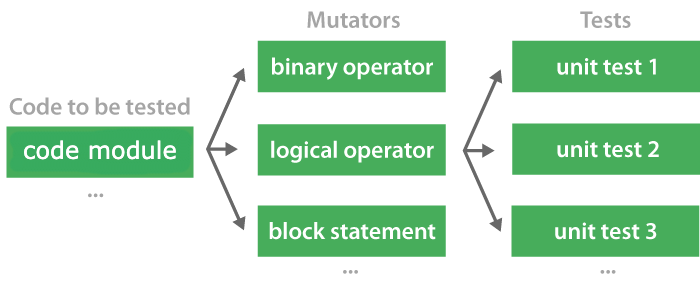
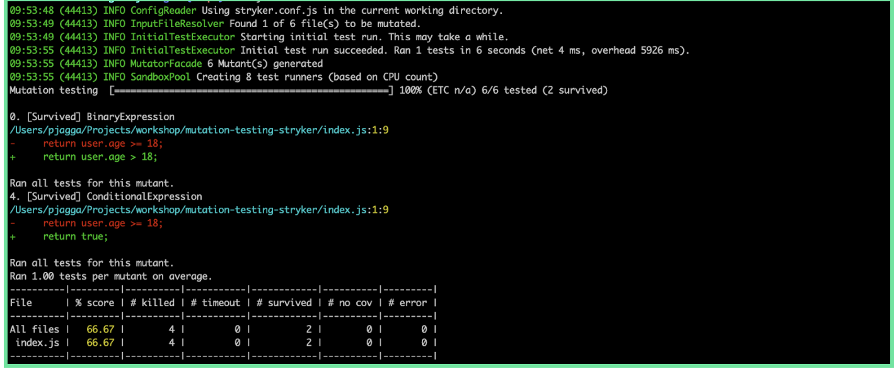
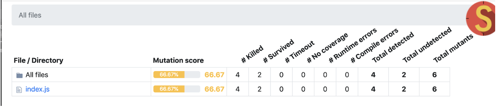

## Mutation Testing

Mutation testing is a way of testing the quality of your tests by introducing changes into application code and seeing if our test suite detects them.

### How does it work ?

Faults are introduced into the source code by creating multiple versions of the code, each version is called a mutant. Each mutant contains a single fault, and the goal is to cause the mutant version to fail which demonstrates the effectiveness of the test cases.

### Mutation Testing with Stryker 

Stryker modifies the code by changing it into different variations called mutants. After the mutants have been generated, they are applied one by one and our tests are executed against them. If at least one of our tests fail, then the mutant is killed. And that's what we want! If no tests fail, then the mutant has survived. The better our tests, the fewer mutants should survive.

Stryker can output the results in a variety of different formats. 

One of the easiest to read is the clear text reporter as follow:

Other way to report is to use html reporter as as shown below:

### Try it yourself

checkout "step1" branch to explore a simple example